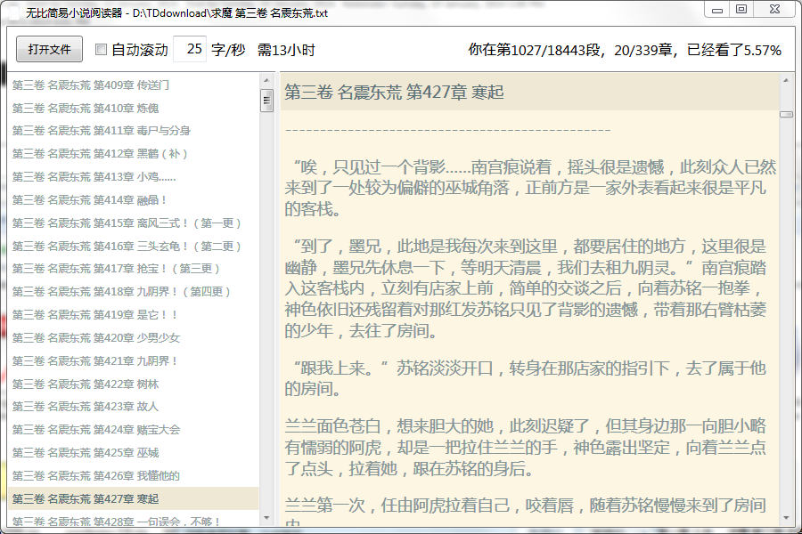

# 无比简易小说阅读器 (UltraSimpleTxtReader)

无比简易的小说阅读器，除了不能朗读意外，自己觉得够用了。

## 基本功能

- 自动抓取TXT小说章节
- 自动记录上次打开的文件和阅读的位置
- 自动滚动阅读（估算阅读时间）
- 显示阅读信息（章节，段落，百分比）
- 快捷键操作:
  - `j` 下一段，`k` 上一段
  - `n` 下一章，`p` 下一章
  - `t` 第一章，`g` 最后一章
  - `h` 选择章节，`l` 阅读小说
- 拖动TXT文件到软件中打开

## 下载

[下载地址](https://github.com/zhuochun/novelReader/releases)

- 支持Windows 7+

## 许可

Copyright (c) 2014 **[Wang Zhuochun](https://github.com/zhuochun)**.
Licensed under the MIT license.
